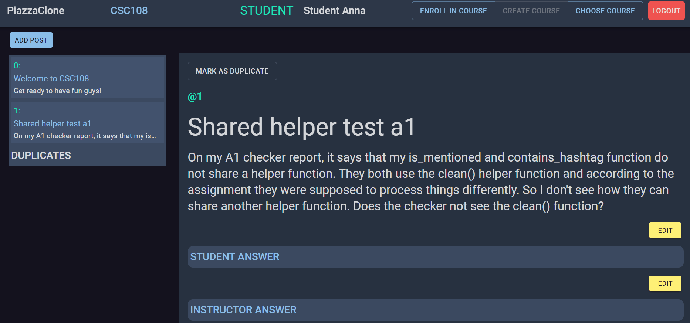

# PiazzaClone

A Full Stack Application for a POC of a piazza-based bot. Made using the **FARM** Stack i.e. **F**ast**A**PI, **R**eact and **M**ongoDB. The main purpose of the bot is to reduce duplicate posts created by students and reduce the redundant work instructors have to do. The bot can accomplish this by using existing resources for the **NLP** task: semantic text similarity (**STS**). The bot follows up on new posts with potential duplicates and then marks the new post as a duplicate after being prompted by the creator.

__More Details__:
We use the pre-trained model **paraphrase-MiniLM-L12-v2** from **sentence_transformers** in python to create text embeddings. Then. we utilize **cosine_similarity** as a measure of similarity between the two text embeddings and if the __cosine similarity__ surpasses some benchmark, we declare it to be a duplicate. This is how the bot determine duplicate posts.

### Technology and Tools

  

## Bot Demo



### Setting Up (Windows)

```bash
# clone the repo
git clone https://github.com/saad-afridi/PiazzaClone
```

#### Backend

```bash
# Go into the backend
cd backend

# [OPTIONAL] Create and activate virtual environment
pip install virtualenv
virtualenv venv
venv\Scripts\activate.bat

# Downloading dependencies
pip install -r requirements.txt

# Setup your mongo database
echo MONGO_ATLAS_URI=mongodb+srv://... > .env

# Run the server
python main.py

# [OPTIONAL] Run sanity tests
python -m pytest
```

#### Frontend

```bash
# Go into frontend
cd frontend

# download dependencies
npm install

# Start the application
npm start
```

#### Bot

```bash
# Go into bot
cd bot

# Run the bot
python main.py
```
